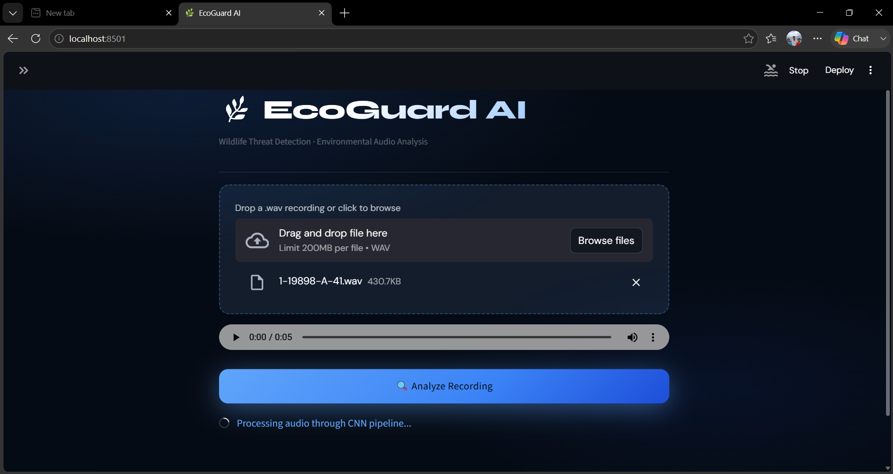
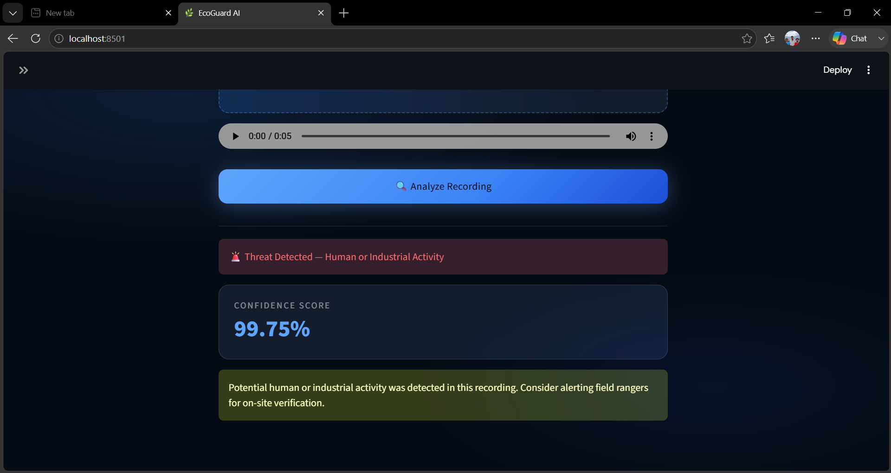
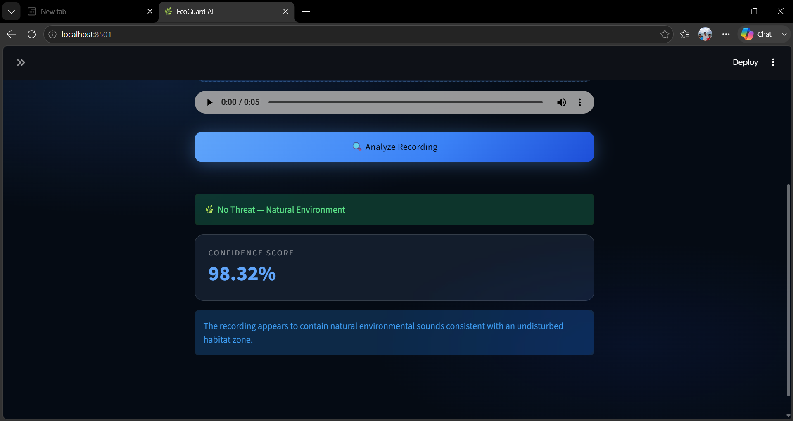

# 🌿 EcoGuard AI

### Wildlife Threat Detection using Deep Learning and Environmental Audio Analysis

EcoGuard AI is a Deep Learning-based environmental audio classification system designed to identify potential threats in wildlife habitats using acoustic monitoring.

The system analyzes environmental sound recordings, converts them into Mel Spectrogram representations, and uses a Convolutional Neural Network (CNN) to classify sounds as either:

* 🚨 Threat
* 🌿 Non-Threat

This project demonstrates how Artificial Intelligence can support wildlife conservation, forest monitoring, and environmental protection through automated sound analysis.

---

# 📸 Application Preview

## 📸 Application Preview








---

# 📖 Project Overview

Wildlife habitats are increasingly threatened by illegal logging, vehicle intrusion, industrial activities, and other human-generated disturbances.

Traditional monitoring systems require continuous human supervision, making large-scale deployment difficult and expensive.

EcoGuard AI explores the use of Deep Learning and environmental audio classification to automatically detect potentially harmful activities through acoustic signals.

The project utilizes the ESC-50 environmental sound dataset and transforms environmental audio recordings into image-like Mel Spectrogram representations for CNN-based classification.

---

# 🎯 Problem Statement

Environmental monitoring plays a crucial role in wildlife conservation.

Human-generated sounds such as:

* Chainsaws
* Vehicle Engines
* Industrial Machinery
* Helicopters
* Sirens

can indicate activities that threaten wildlife ecosystems.

The objective of this project is to automatically classify environmental sounds into:

### 🚨 Threat

Sounds associated with potential human interference.

### 🌿 Non-Threat

Natural environmental sounds that are commonly present in wildlife habitats.

---

# 📊 Dataset

This project uses the ESC-50 Dataset.

The ESC-50 dataset contains:

* 2000 environmental audio recordings
* 50 semantic sound classes
* 40 samples per class
* 5-second duration audio clips

The dataset includes sounds from:

* Animals
* Natural Soundscapes
* Water Sounds
* Human Activities
* Domestic Environments
* Urban Environments

Each audio sample is accompanied by metadata describing its semantic class.

---

# 🏷 Threat Mapping Strategy

Since ESC-50 was not originally designed for wildlife threat detection, the original classes were manually grouped into two categories.

## 🚨 Threat Sounds

Examples include:

* Chainsaw
* Engine
* Helicopter
* Airplane
* Siren
* Vehicle Horn
* Jackhammer
* Industrial Machinery

These sounds represent potential human interference or disturbance.

---

## 🌿 Non-Threat Sounds

Examples include:

* Birds
* Insects
* Frogs
* Rain
* Wind
* Water Streams
* Natural Wildlife Vocalizations

These sounds represent normal environmental conditions.

---

# 🔄 Project Pipeline

```text
Raw Audio (.wav)
        │
        ▼
Metadata Processing
        │
        ▼
Threat / Non-Threat Label Creation
        │
        ▼
Audio Exploration
        │
        ▼
Mel Spectrogram Generation
        │
        ▼
NumPy Dataset Creation
        │
        ▼
Train-Test Split
        │
        ▼
CNN Training
        │
        ▼
Model Evaluation
        │
        ▼
Streamlit Deployment
```

---

# 🎵 Audio Processing

Environmental audio recordings are transformed into Mel Spectrogram representations before being used for model training.

### Why Mel Spectrograms?

* Preserve frequency information
* Capture temporal acoustic patterns
* Widely used in speech and audio recognition
* Compatible with Convolutional Neural Networks

Generated spectrograms are stored as NumPy arrays and directly fed into the CNN model.

---

# 🧠 CNN Architecture

The custom CNN architecture consists of three convolutional feature extraction blocks followed by a dense classification head.

## Convolution Block 1

* Conv2D (32 Filters)
* Batch Normalization
* ReLU Activation
* MaxPooling

## Convolution Block 2

* Conv2D (64 Filters)
* Batch Normalization
* ReLU Activation
* MaxPooling

## Convolution Block 3

* Conv2D (128 Filters)
* Batch Normalization
* ReLU Activation
* MaxPooling

## Classification Head

* GlobalAveragePooling2D
* Dense (128)
* ReLU
* Dropout (0.3)
* Dense (64)
* ReLU
* Dropout (0.3)
* Dense (1, Sigmoid)

---

# ⚙ Training Configuration

| Parameter            | Value               |
| -------------------- | ------------------- |
| Optimizer            | Adam                |
| Loss Function        | Binary Crossentropy |
| Batch Size           | 16                  |
| Epochs               | 50                  |
| Early Stopping       | Enabled             |
| Restore Best Weights | True                |

---

# 📈 Model Performance

## Test Set Results

| Metric    | Score  |
| --------- | ------ |
| Accuracy  | 84.52% |
| Precision | 88.57% |
| Recall    | 77.50% |
| F1 Score  | 82.67% |

---

## Confusion Matrix

```text
                Predicted
              NonThreat  Threat

Actual
NonThreat         80        8
Threat            18       62
```

---

# 🔍 Result Analysis

The model demonstrates strong performance in distinguishing threat and non-threat environmental sounds.

## Strengths

* High Precision (88.57%)
* Good Overall Accuracy (84.52%)
* Strong Threat Identification Capability
* Robust Environmental Audio Classification

## Limitations

* Some Threat Sounds are misclassified as Non-Threat
* Recall can be improved for deployment scenarios
* Dataset size remains relatively small for Deep Learning

---

# 📂 Project Structure

```text
Wildlife-Threat-Detection
│
├── assets
│   └── images
│
├── datasets
│   ├── raw
│   └── processed
│
├── notebooks
│   ├── 01_dataset_understanding.ipynb
│   ├── 02_label_creation.ipynb
│   ├── 03_audio_exploration.ipynb
│   ├── 04_feature_extraction.ipynb
│   └── 05_cnn_training.ipynb
│
├── models
│   └── threat_detector.keras
│
├── app.py
├── requirements.txt
├── README.md
└── .gitignore
```

---

# 🛠 Technologies Used

* Python
* NumPy
* Pandas
* Matplotlib
* Librosa
* TensorFlow
* Keras
* Scikit-Learn
* Streamlit
* Jupyter Notebook

---

# 🚀 Future Improvements

### Audio Data Augmentation

* Noise Injection
* Time Shifting
* Pitch Shifting

### Transfer Learning

* MobileNetV2
* EfficientNet
* ResNet

### Real-Time Monitoring

* Live Microphone Input
* Continuous Threat Detection

### Multi-Class Threat Classification

* Chainsaw Detection
* Vehicle Detection
* Helicopter Detection
* Machinery Detection
* Human Activity Detection

### Edge Deployment

* Raspberry Pi
* Jetson Nano
* IoT Wildlife Monitoring Devices

### Explainable AI

* Grad-CAM Visualization
* Spectrogram Attention Maps

---

# ▶ Installation

Clone the repository:

```bash
git clone https://github.com/sujitx-vs/Wildlife-Threat-Detection.git
```

Navigate to the project directory:

```bash
cd Wildlife-Threat-Detection
```

Install dependencies:

```bash
pip install -r requirements.txt
```

---

# ▶ Running the Application

Launch the Streamlit application:

```bash
streamlit run app.py
```

If Streamlit is not recognized:

```bash
python -m streamlit run app.py
```

---

# 📌 Conclusion

EcoGuard AI demonstrates an end-to-end Deep Learning pipeline for environmental audio classification using Mel Spectrograms and Convolutional Neural Networks.

The developed model achieved an accuracy of **84.52%** and successfully learned meaningful acoustic patterns that distinguish natural wildlife sounds from potentially harmful human-generated activities.

The project highlights the potential of AI-powered acoustic monitoring systems for wildlife conservation, forest surveillance, and environmental protection.
